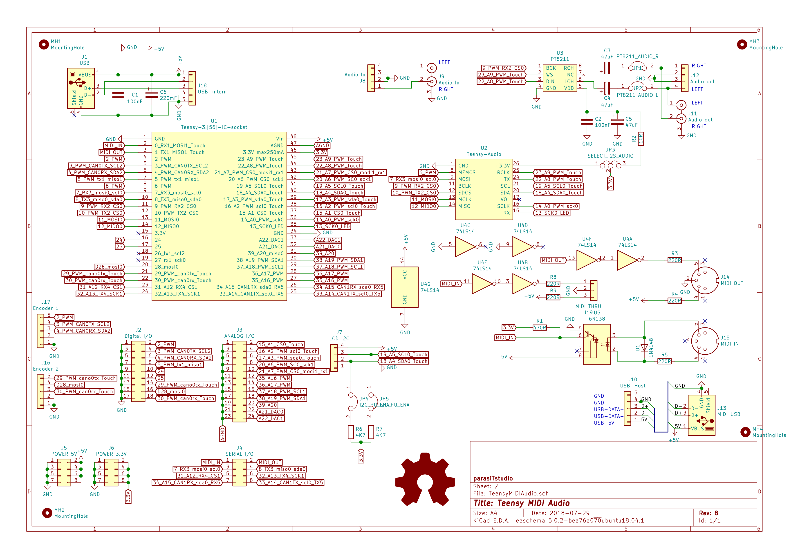
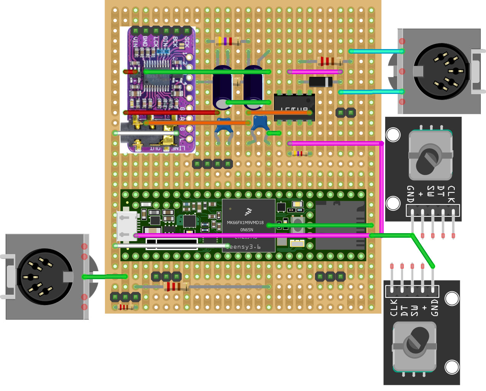
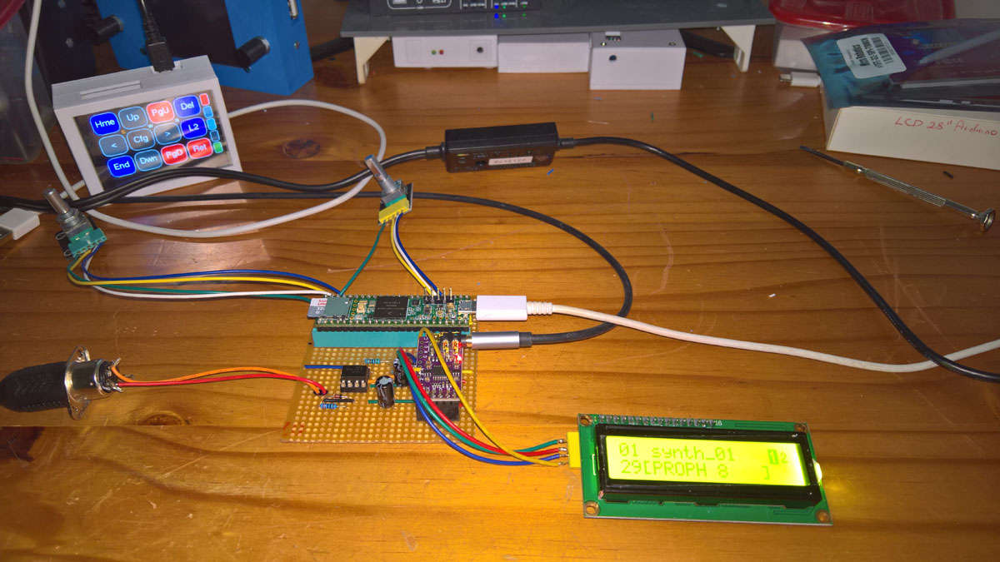
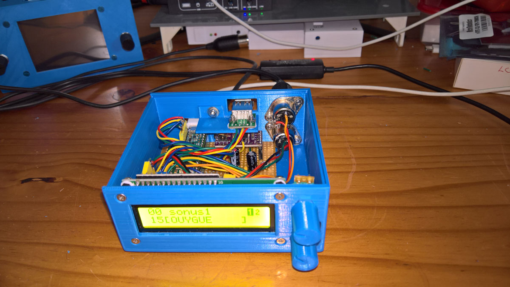
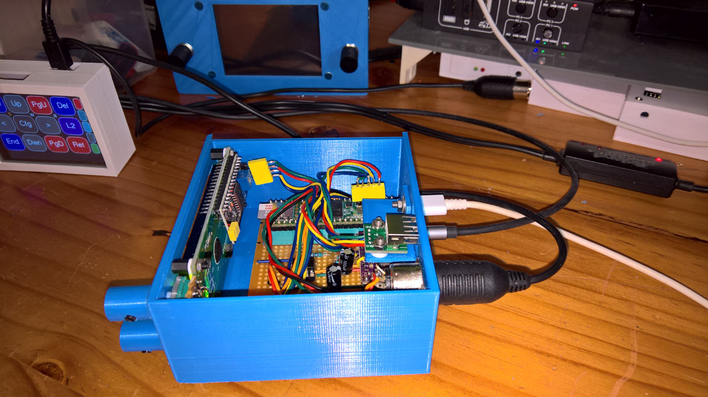
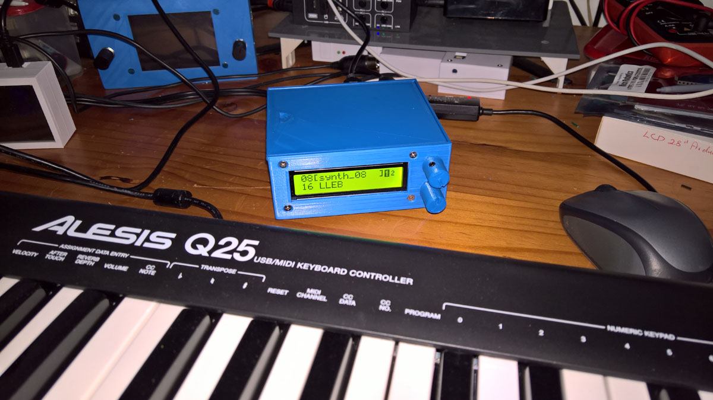
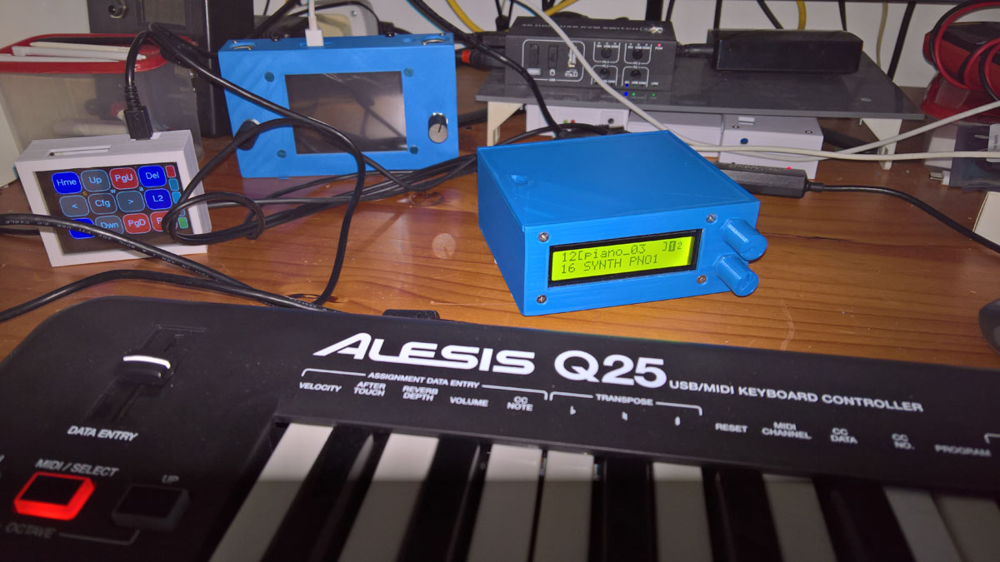

# Microdexed with Teensy 3.6 and PCM5102A and 16x2Character i2c LCD and a 6N137 Midi In

This is a variation of the MicroDexed 6-operator-FM-YanahDX7-Synth by [**Codeberg-dcoredump**](https://codeberg.org/dcoredump/MicroDexed). It replaced the (recommended) Teensy Audio board with an inexpensive PCM5102A DAC module, and used a 6N137 for the Midi input. The changes made to the config.h file are included here. Also include here is the firmware (hex file) used that can be uploaded to the Teensy 3.6 using the Teensyloader.

What was immediately strinking is how quiet this synth is - no digital noise is audible. The Teensy 3.6 was chosen instead of the Teensy 4x because it is likely that the two Teensy 3.6 12-bit DACs will programmed as a CV output controls in the future.

It is constructed on stripboard and a Fritzing layout is included here, as are the 3d-files for the case. 

 
 
 

 
 
 

 
 
 

Note the warning when [**using i2c Backpacks with 5v LCD displays and 3v3 MCU's or Raspberry Pi's**](https://github.com/TobiasVanDyk/Microdexed-Synth-Variations/tree/main/i2cbackpack)
