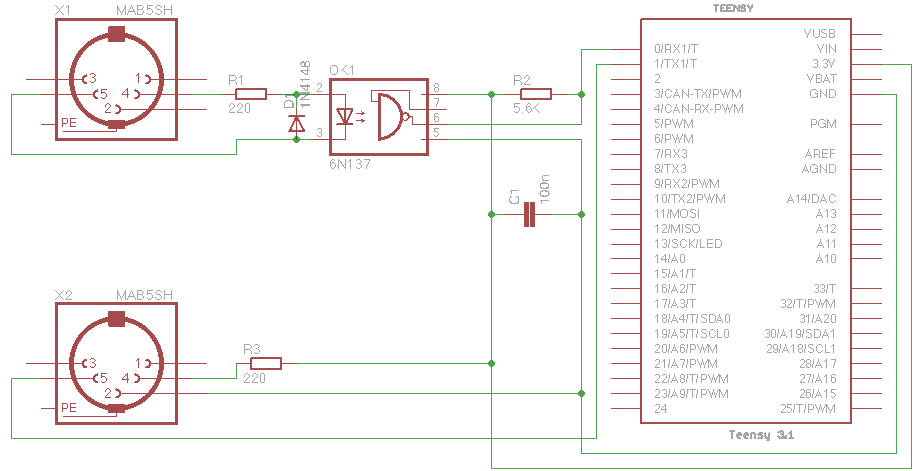

# Microdexed with Teensy 3.6 and PCM5102A and 16x2Characteri2c LCD and a 6N137 MidiIn

This is variation of the MicroDexed 6-operator-FM-YanahDX7-Synth by [**Codeberg-dcoredump**](https://codeberg.org/dcoredump/MicroDexed). It replaced the Teensy Audio board with an inexpensive PCM5102A module, and used a 6N137 for the Midi input. Changes made to the config.h file are included and the customised firmware-compiled hex file that can be loaded to the this Teensy 3.6 synth using the Teensyloader are also included here.

What was immediately strinking is how quiet the synth is - no digital noise is audible. The Teensy 3.6 was chosen instead of the Teensy 4x because it is likely that the two Teensy 3.6 12-bit DACs will programmed as a CV output controls.

It is constructed on stripboard and a Fritzing layout is included here, as are the 3d-case files.

 
 
 

 
 
 

 
 
 

