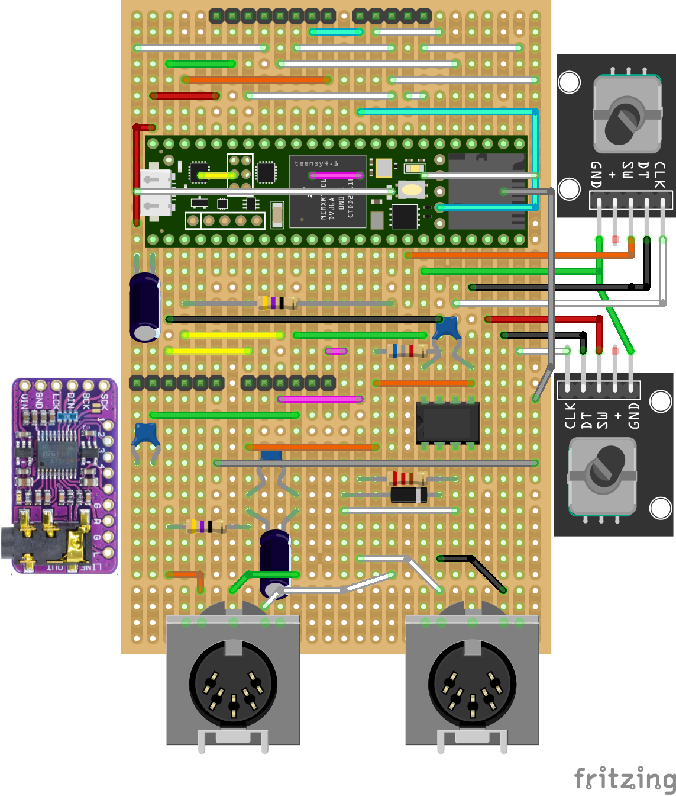

# Microdexed-Touch with Teensy 4.1 and PCM5102A and 3.2inch ILI9341 TouchLCD and a 6N137 Midi-In

This is a variation of the Microdexed Touch FM Synth (Yamaha-DX7) by [**Codeberg-positionhigh**](https://codeberg.org/positionhigh/MicroDexed-touch). It replaced the 2.8 inch LCD with a 3.2 inch LCD, and used full-sized Midi in and out sockets, with a 6N137 for the Midi input. Compiled version 1.53 PSRAM+Flash firmware was used.

It is constructed on stripboard and a Fritzing layout is included here, as are the case 3d-files.

 
 
 

 
 
 

 
 
 

