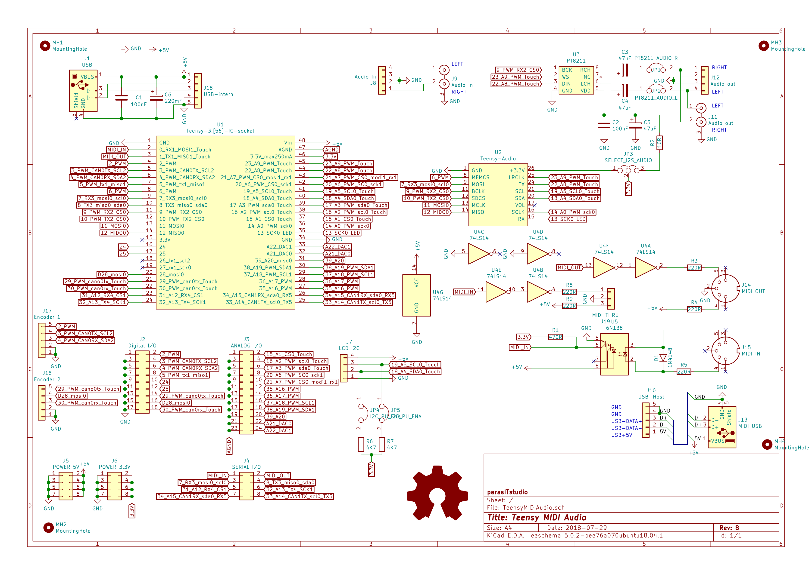
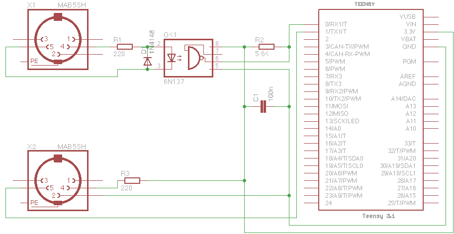
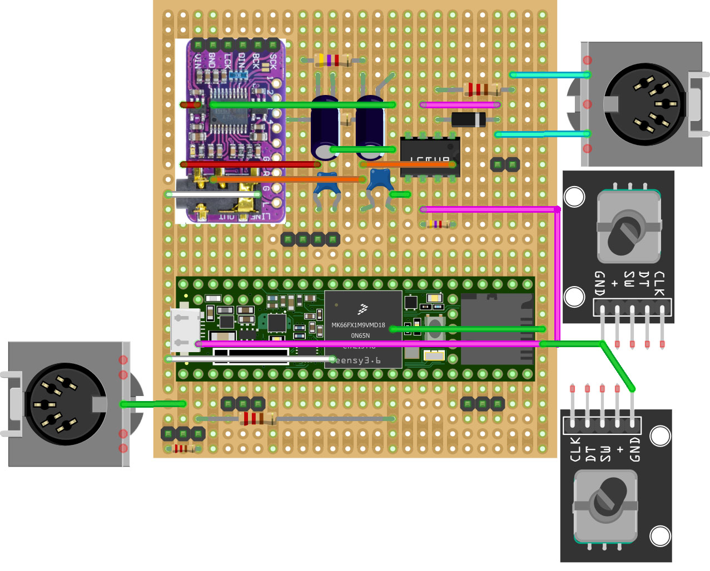
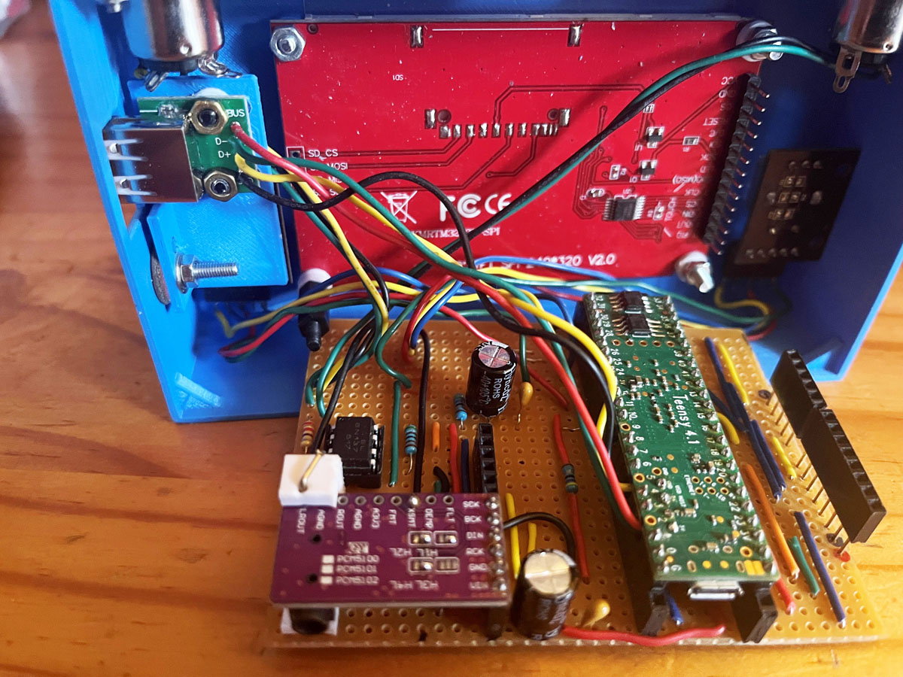

# Microdexed-Touch: Teensy 4.1 - PCM5102A DAC - 3.2inch ILI9341 Resistive Touch LCD - 6N137 Midi-In

This is a variation of the Microdexed Touch FM Synth (Yamaha-DX7) by [**Codeberg-positionhigh**](https://codeberg.org/positionhigh/MicroDexed-touch). It replaced the capactive touch 3.2 inch LCD with a resistive touch LCD, uses full-sized Midi in and out sockets with a 6N137 for the Midi input. Compiled versions 1.9.8.7 (16 MB PSRAM) and 1.7.1 (8 MB PSRAM 16 MB Flash), firmware was used. 

Both firmware versions are shown below, the stripboard layout for both are the same as only the Flash module is removed from its socket on the stripboard, and a second 8MB PSRAM module was soldered on the back of the Teensy 4.1. The .hex firmware for the two versions are in the folders PSRAM8-Flash-v171 and PSRAM16-v1987. Replace platformio.ini and config.h with those included in the folders if new versions are compiled.

The stripboard Fritzing layout is included here, as are the case 3d-files. Refer to the photo included in the [**issue here**](https://github.com/TobiasVanDyk/STM32F411-PCM5102A-24bit-USB-Audio-DAC/issues/2) for how to bridge three of the DAC module option pads.

The older schematic for a resistive touch LCD is shown below for the new schematic refer to the [**March 2025 build manual**](https://codeberg.org/positionhigh/MicroDexed-touch/wiki/BUILD-AND-USER-MANUAL)

 
 
 

 
 
 

 
 
 

Note the warning when [**using i2c Backpacks with 5v LCD displays and 3v3 MCU's or Raspberry Pi's**](https://github.com/TobiasVanDyk/Microdexed-Synth-Variations/tree/main/i2cbackpack)
