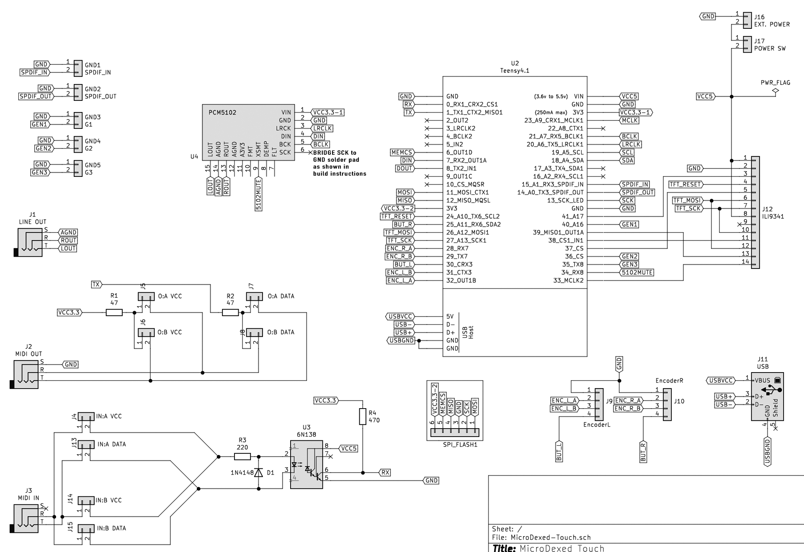
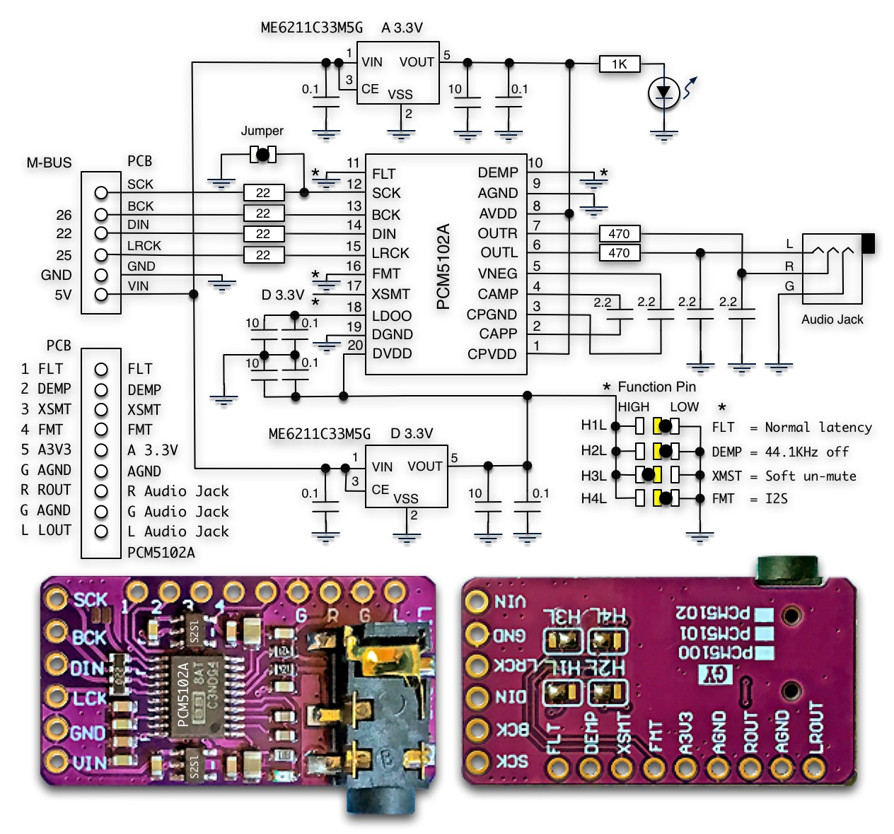
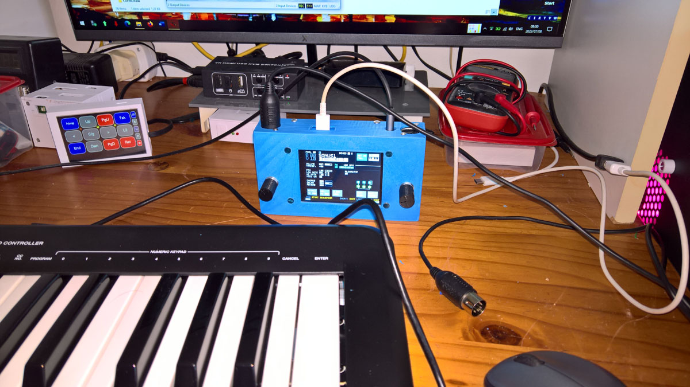
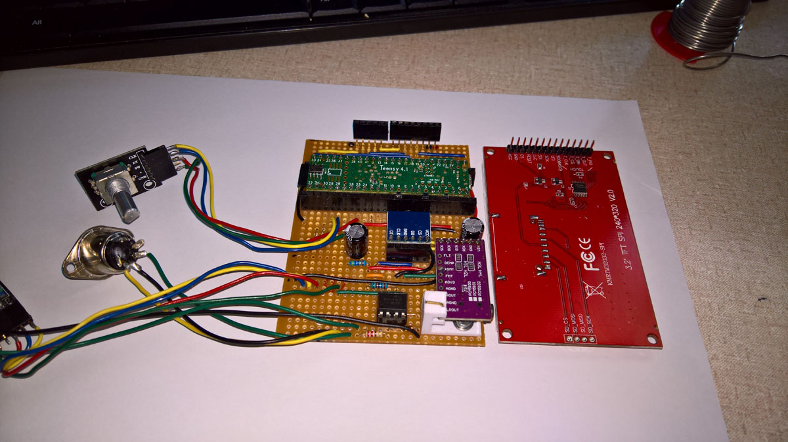
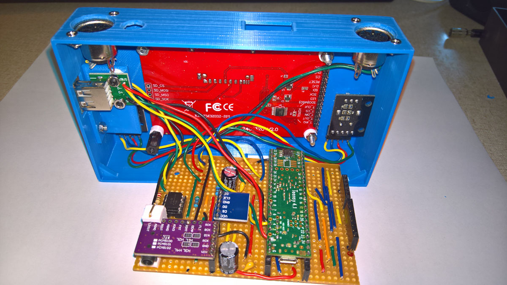
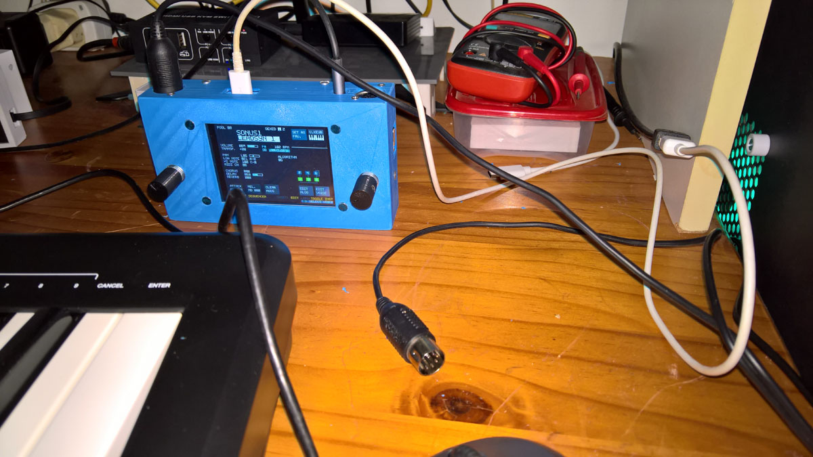
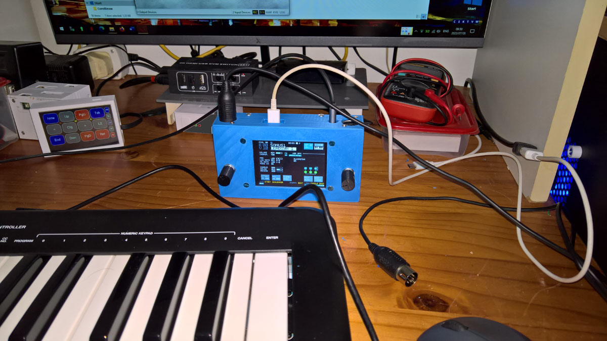

# Microdexed-Touch with Teensy 4.1.6 and PCM5102A and 3.2inch ILI9431 TouchLCD and a 6N137 MidiIn

This is variation of the Microdexed Touch FM-YamahDX7-Synth by [**Codeberg-positionhigh**](https://codeberg.org/positionhigh/MicroDexed-touch). It replaced the 2.8 inch LCD with a 3.2 inch size, and used full-sized Midfi in and out sockets, and, and used a 6N137 for the Midi input. The released 1.52 PSRAM+Flash firmware was used.

It is constructed on stripboard and a Fritzing layout is included here, as are the 3d-case files.

 
 
 

 
 
 

 
 
 

