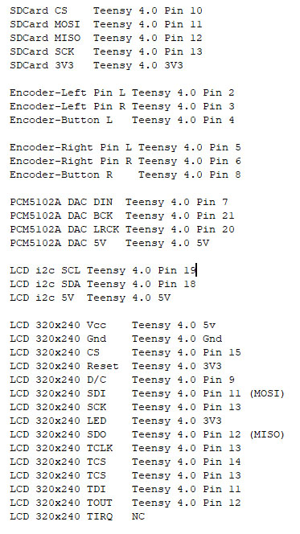
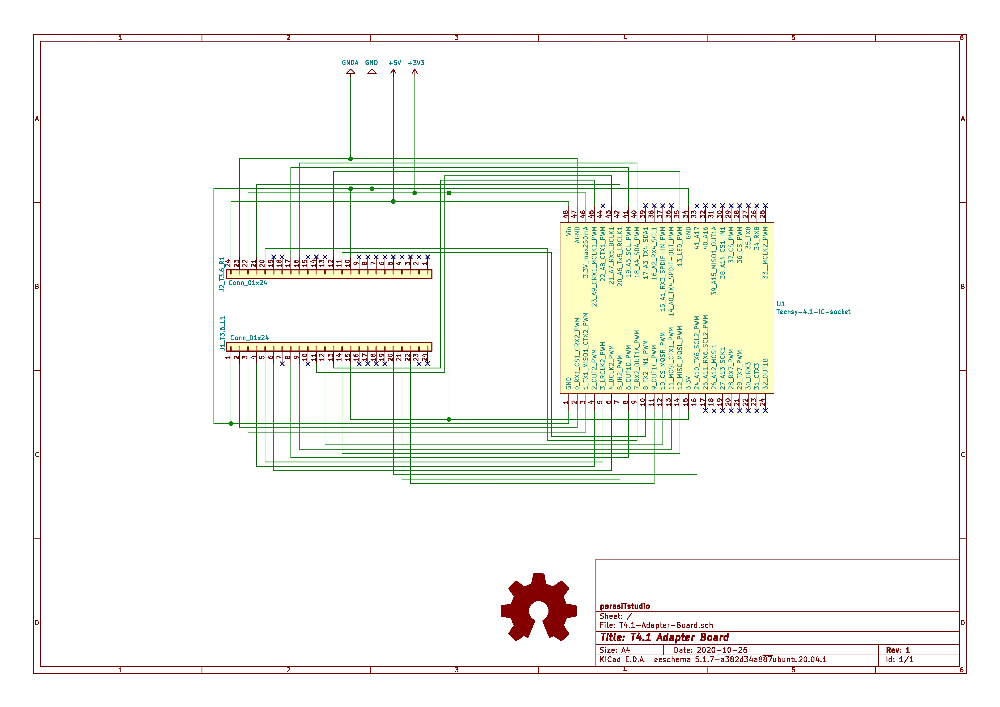

# Microdexed with Teensy 4.0 and PCM5102A and 16x2Character i2c LCD and a 6N137 Midi In

This is variation of the MicroDexed 6-operator-FM-YanahDX7-Synth by [**Codeberg-dcoredump**](https://codeberg.org/dcoredump/MicroDexed). It replaced the Teensy Audio board with an inexpensive PCM5102A module, and used a 6N137 for the Midi input. Changes made to the config.h file are included and the customised firmware-compiled hex file that can be loaded to the this Teensy 4.0 synth using the Teensyloader are also included here.

It is currently constructed on a breadboard and the connections between the Teensy 4.0 and the [**SDCard module**](images/SDCard.jpg), the two encoders, the PCM5102A DAC and the LCD are given in [**Connections.txt**](Connections.txt). The changed DAC connections are not described in config.h and had to be traced from a [**Teensy 4.1 to teensy 3.6 adapter board**](images/T41-Adapter-Board.jpg) from another repository.

 
 
 

