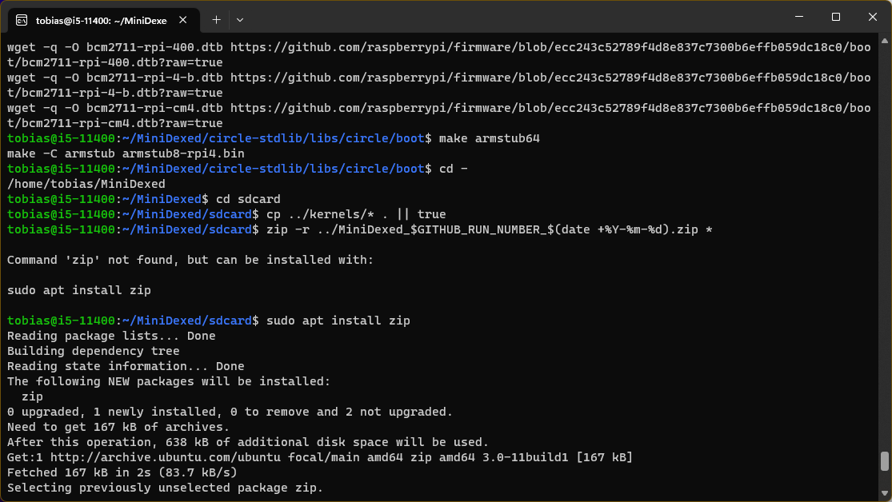
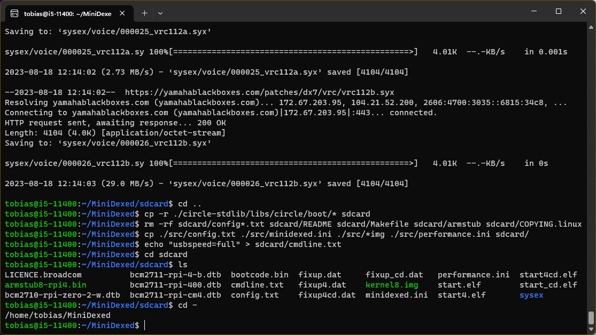
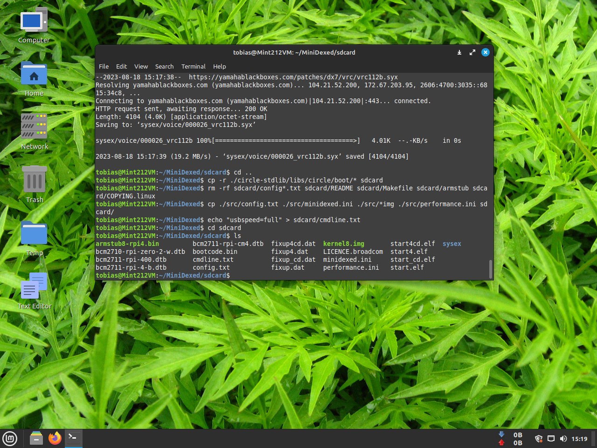

# Compiling Minidexed under WSL2 (Ubuntu 20.04) on Windows 11

## Minidexed with Raspberry Pi 3B+ using a Waveshare WM8960 DAC hat and a 6N137 MidiIn
Using a updated Ubuntu 20.04 WSL2 on Windows 11 for compiling Minidexed was quick - a few minutes - but there are a few additional steps not mentioned on the [**Minidexed Wiki**](https://github.com/probonopd/MiniDexed/wiki/Development).

A fresh WSL2 also needs:
``` 
sudo apt-get install build-essential
sudo apt install zip
``` 

You also need a Config.mk file with the content:
``` 
AARCH = 64
RASPPI = 3
PREFIX64 = aarch64-none-elf-
``` 

Copied to both ~/MiniDexed/circle-stdlib/ and ~/MiniDexed after the git clone operations has been completed but before ./build.sh

Then follow the steps as in compile-history.txt i.e. start with:

``` 
export RPI=3
git clone https://github.com/probonopd/MiniDexed
cd MiniDexed
mkdir -p kernels sdcard
git submodule update --init --recursive
sh -ex submod.sh
wget https://developer.arm.com/-/media/Files/downloads/gnu-a/10.3-2021.07/binrel/gcc-arm-10.3-2021.07-x86_64-aarch64-none-elf.tar.xz
tar xvf gcc-arm-*-*.tar.xz
export PATH=$(readlink -f ./gcc-*/bin/):$PATH
./build.sh
cp ./src/kernel*.img ./kernels/
cd ./circle-stdlib/libs/circle/boot
make
make armstub64
cd -
cd sdcard
cp ../kernels/* . || true
zip -r ../MiniDexed_$GITHUB_RUN_NUMBER_$(date +%Y-%m-%d).zip *
../getsysex.sh
cd ..
cp -r ./circle-stdlib/libs/circle/boot/* sdcard
rm -rf sdcard/config*.txt sdcard/README sdcard/Makefile sdcard/armstub sdcard/COPYING.linux
cp ./src/config.txt ./src/minidexed.ini ./src/*img ./src/performance.ini sdcard/
echo "usbspeed=full" > sdcard/cmdline.txt
``` 

The resulting unmodified sdcard folder is here as compiled-sdcard.zip, with the modified minidexed.ini for the specifiec hardware used, also here.

<p align="left">
 
 
</p>

Using exactly the same procedure under Linux Mint 21.2 also yielded a functional setup - refer to the screenshot below - and the sdcard files are in sdcard.tar.gz.

<p align="left">
 
</p>
