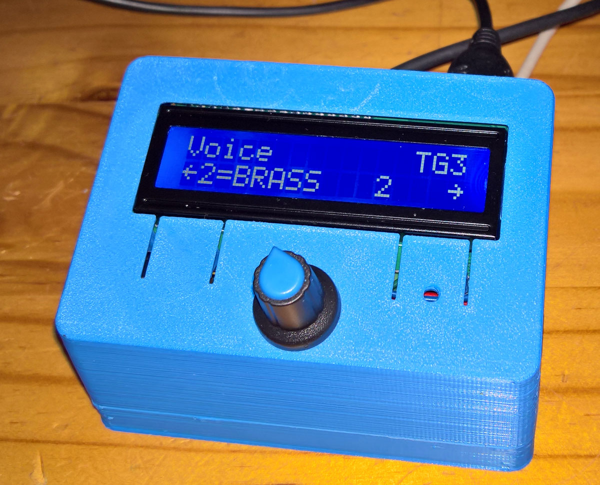

# Minidexed with Raspberry Pi 3B using a Waveshare WM8960 DAC hat and a 6N137 MidiIn

This is variation of the Minidexed 8xDX7 (Yamaha-DX7-Synth) by [**Probonopd**](https://github.com/probonopd/MiniDexed). 

It used the snap-close 3d-case made available there. Two changes were made: (1) This uses the i2s + i2c [**Waveshare WM8960 DAC**](https://www.waveshare.com/wm8960-audio-hat.htm) as [**discussed here**](https://github.com/TobiasVanDyk/RaspberryPi-GPIO-Audio) and [**here**](https://github.com/TobiasVanDyk/Wolfson-WM8960-Arduino-Teensy-Driver), and sounds great. (2) A [**DIN 6N137 Midi-In**](images/6N137Midi.png) was also added. A list of the [**hardware and build intructions**](https://github.com/probonopd/MiniDexed/wiki/Hardware) are presented in detail there. 

The Minidexed can be used as a USB Midi host i.e. it can play via a Midi USB keybpoard plugged into the Minidexed Raspberry Pi USB ports, but needs something such as a ATMega32U4 (Arduino Pro Micro) or RPi Pico, to act as a a USB Midi device i.e. appear to a PC as a [**USB Midi device**](https://github.com/probonopd/MiniDexed/discussions/236).

 
 

 
 
 

