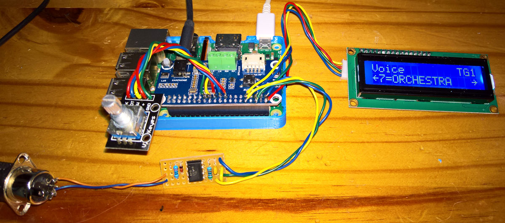

# Minidexed with Raspberry Pi 3B and MT32-Pi with a Raspberry Pi 3A+

## Minidexed with Raspberry Pi 3B using a Waveshare WM8960 DAC hat and a 6N137 MidiIn
This is variation of the Minidexed 8xDX7 (Yamaha-DX7-Synth) by [**Probonopd**](https://github.com/probonopd/MiniDexed) and [**Circle**](https://github.com/rsta2/circle) which runs the RPi as a if it is an MCU. (Circle is a C++ bare metal programming environment for the Raspberry Pi - i.e. it is not a RTOS.)

It used the snap-close 3d-case made available there. Two changes were made: (1) This uses the i2s + i2c [**Waveshare WM8960 DAC**](https://www.waveshare.com/wm8960-audio-hat.htm) as [**discussed here**](https://github.com/TobiasVanDyk/RaspberryPi-GPIO-Audio) and [**here**](https://github.com/TobiasVanDyk/Wolfson-WM8960-Arduino-Teensy-Driver), and sounds great. (2) A [**DIN 6N137 Midi-In**](images/6N137Midi.png) was also added. A list of the [**hardware and build intructions**](https://github.com/probonopd/MiniDexed/wiki/Hardware) are presented in detail on the Minidexed Github. 

The Minidexed can be used as a USB Midi host i.e. it can play via a Midi USB keyboard plugged into the Minidexed Raspberry Pi USB ports, but needs something such as a ATMega32U4 (Arduino Pro Micro) or RPi Pico, to act as a a USB Midi device i.e. appear to a PC as a [**USB Midi device**](https://github.com/probonopd/MiniDexed/discussions/236).

 
 

 
 
 

## MT32-Pi with a Raspberry Pi 3A+ using a Waveshare WM8960 DAC hat and an SH1106 128x64 OLED display and a 6N137 MidiIn
The [**MT32-Pi**](https://github.com/dwhinham/mt32-pi) Roland-MT32, similarly runs on Circle, and is also a baremetal MIDI synthesizer (for a Raspberry Pi 3 or above), based on Munt and FluidSynth, but the interface needs further development. It is currently only constructed on breadboard and used a Raspberry Pi 3A+, and the same WM8960 DAC but used an SH1106 OLED 128x64 display. The mt32-pi.cfg used is included here.

 

