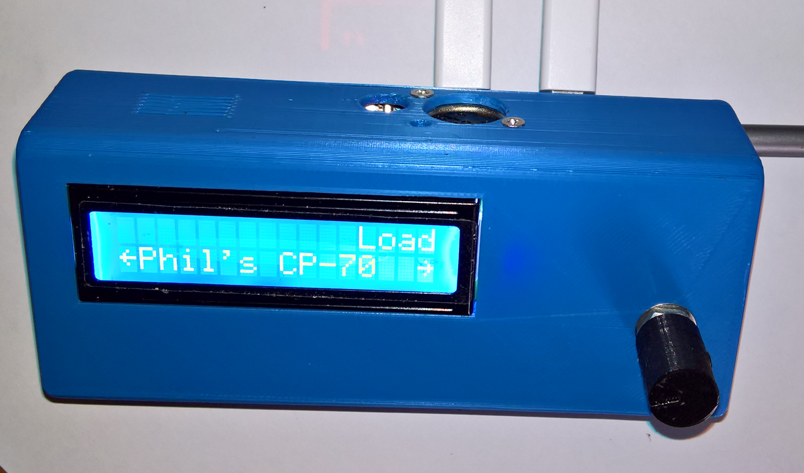
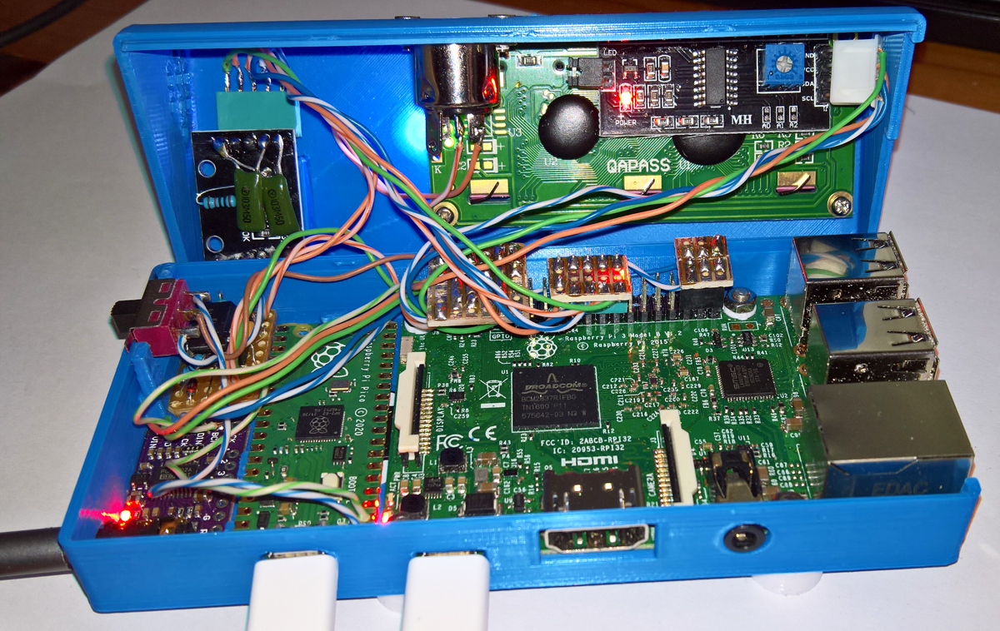

# Minidexed with Pico USBMidi Interface for a Minidexed Raspberry Pi 3B

**This is a Minidexed with Raspberry Pi 3B using a PCM5102A module, a Pico RP2040 PC USBMidi-Interface, and a 6N137 Midi 5pin DIN Input**

This is another variation of the Minidexed DX7-Synth by [**Probonopd**](https://github.com/probonopd/MiniDexed) and [**Circle**](https://github.com/rsta2/circle) which runs the RPi as a if it is an MCU. 

It uses the excellent [**snap-close**](images/DHSbuild.png) 3d-printed case [**presented by dhstsw here**](https://github.com/probonopd/MiniDexed/discussions/165), and the top and modified bottom (the trimpot was replaced with a 6N137 Midi Interface and a 5pin DIN socket added) STL files are in the STL folder. The modified case here is still a WIP. 

The Pico and Minidexed Tx-Rx Midi interface is [**discussed here**](https://github.com/TobiasVanDyk/Microdexed-Synth-Variations/tree/main/PicoUSBMidi-PCInterface).

   
 
 

