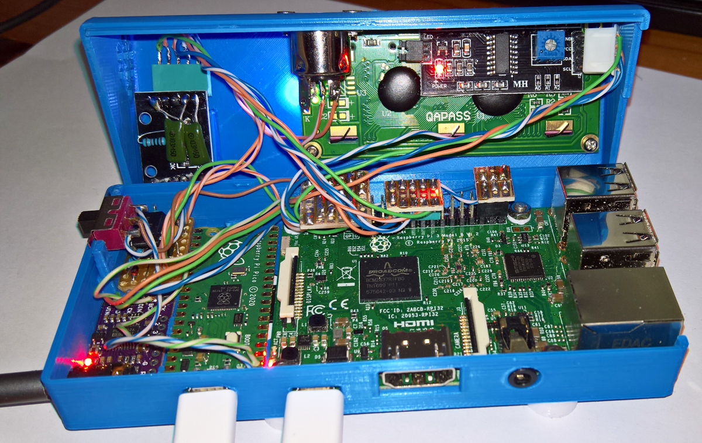
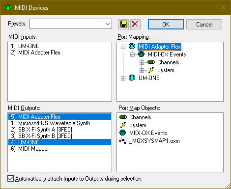
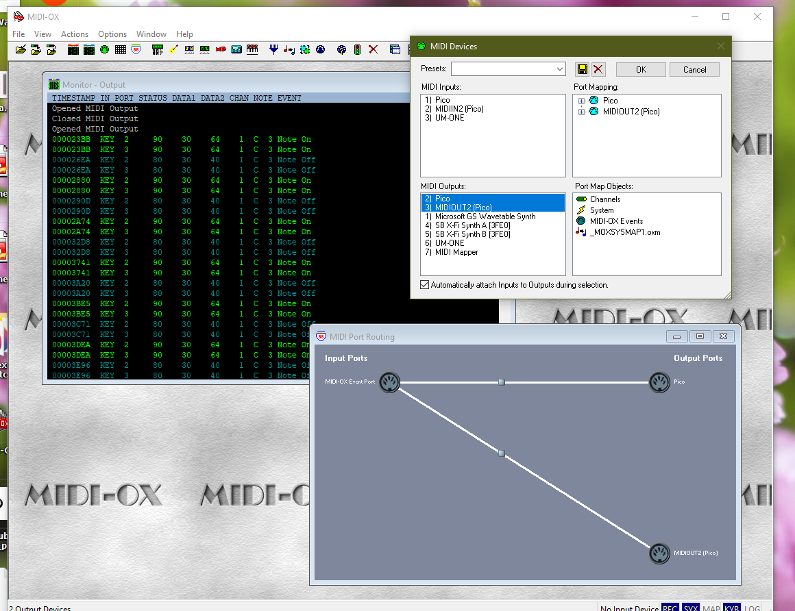

## Pico RP2040 as USB Midi PC Interface for the Raspberry Pi Minidexed

Three different PC USB-Midi Interfaces were compiled and tested as a means to connect the Minidexed RaspberryPi 3B to a PC as a Midi Synth device. Two are Pico-SDK-based and the third is Arduino IDE-based. All three worked well and will be expanded on in the future. Currently the neatly-coded Midi-Adapter by rsta2 is installed in the Minidexed Synth referred to here as Minidexed2.

* **USB-Midi Interfaces 1 and 2:** These are Pico SDK-based and are from the same [**rsta2 Github**](https://github.com/rsta2/pico) as the Circle libraries. Both were compiled on Windows 10 using the [**instructions available here**](https://github.com/TobiasVanDyk/Pico-MCU-from-Raspberry-Pi/blob/main/Install-Pico-SDK-in-Windows10x64-May-2023.pdf), and both the build directories and the uf2 files are here as Midi-Adaptor.zip. Both interfaces were connected using the Pico's UART0-TX (Pin1) and 3v3 (Pin36) via two 47ohm resistors to a 6N137 optical 5Pin Midi DIN input (in turn connected the the Raspberry Pi's Rx pin). Alternatively they were connected via the Pico GND (Pin3) and TX0 (Pin1) directly to the raspberry Pi's RX Pin. Midi-Ox shows Midi-Adaptor-Flex as having one input and one output - refer to the picture below. (The Um ONE adapter is a Roland UM-One Mk2)

* **USB-Midi Interface 3:** This is [**based on the discussion here**](https://www.reddit.com/r/raspberrypipico/comments/11w8f29/multiple_virtual_usb_midi_cables_using_arduino_ide/?rdt=64233), and the code presented there were compiled using the Earle-Philhower Arduino IDE setup. The ino and uf2 files are here as DualInOutUSBMidi.zip. This is still a WIP and will be looked at in more detail later, but it is is working with the Minidexed Synth. Midi-Ox shows it as having two inputs and two outputs - refer to the picture below. Both inputs were tested with the Minidexed Raspberry Pi using TX0 and TX1 respectively ie. connected to the Minidexed through the Pico's TX0 (Pin1) and TX1 (Pin6) and 3v3 using 47ohm resistors on both wires. 

There are two ways to connect the Pico to the Minidexed Raspberry Pi. The first is through the (added) Midi optical 6N137 interface using the Pico TX (Pin1) and 3v3 (Pin36) Pins via two 47ohm resistors. The second is to connect the Pico TX0 and Ground directly to the Raspberry Pi's RX (Pin10) and Ground (Pin6) connection. The latter option is used here and a SPDT switch selects between the 6N137-Midi or the Pico-USBMidiPC input to the Minidexed Synth. The picture below shows the Pico USMMidi Interface installed in the Minidexed2, inbetween the PCM5102A DAC modile abd 6N137 Midi-Input on the left, and the Raspberry Pi 3B on the right. Currently the Pico and Raspberry Pi are independantly powered but if the Pico is permantly used the Raspberry Pi could be powered from the Pico's VSys 5v pin. 


<p align="left">
 
 
 
</p>

There is also an fourth option to use Circuitpython the make the Pico-based Midi interface - this was not tested but is [**discussed here**](https://github.com/alf45tar/PedalinoMini) just after the rsta2 SDK -based interface.

* **SDK compile instructions:** Download [**rsta2 Pico**](https://github.com/rsta2/pico) as a zip file and extract under your Pico development folder as a folder pico. Open a Developer Command Prompt Window (Visual Studio Shell) as administrator, and (for example) run: setx PICO_SDK_PATH "C:\Users\Pico\Downloads\pico-sdk" or wherever your own Pico SDK is situated. Then do:
 
``` 
cd pico
mkdir build
cd build
cmake -G "NMake Makefiles" ..
nmake
``` 

This will build all four of the example projects - the uf2 files are inside the build directories.


