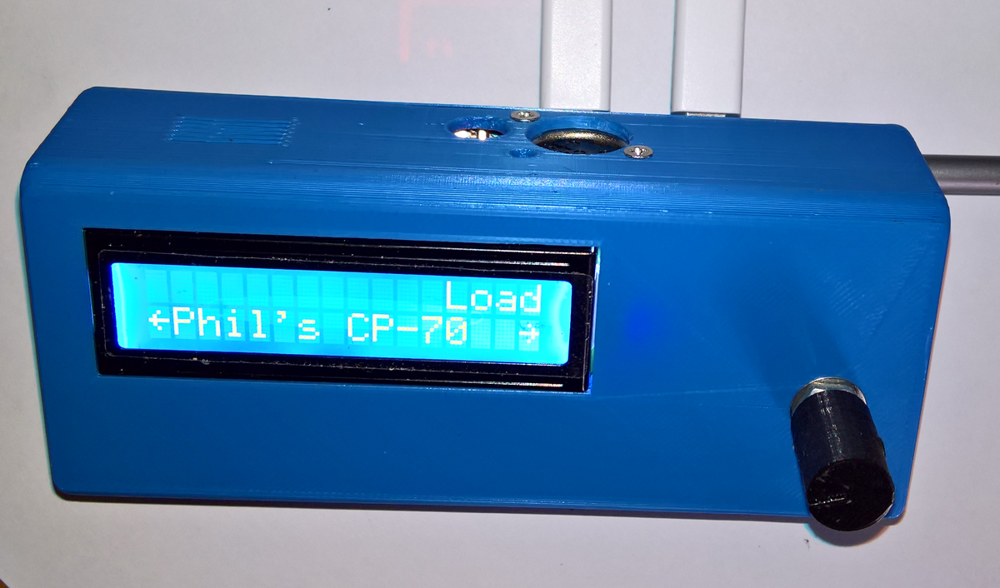

# Microdexed and Minidexed Synth Variations

Variations of the Microdexed FM Synth by [**Codeberg-dcoredump**](https://codeberg.org/dcoredump/MicroDexed) - using a PCM5102A module, and 6N137 for the Midi input, and Microdexed Touch FM Synth by [**Codeberg-positionhigh**](https://codeberg.org/positionhigh/MicroDexed-touch) - it replaced the 2.8 inch LCD with a 3.2 inch sized LCD, used full-sized Midi in and out sockets, and a 6N137 for the Midi input.

In addition four Circle-based Raspberry Pi synths were made: Two Raspberry Pi 3B+ and 3B synth variations of the **miniDexed FM Synth** (which is an 8 x DX7) synth, by [**Probonopd**](https://github.com/probonopd/MiniDexed), two using a using a Waveshare WM8960 DAC Hat and one a PCM5102A DAC module, and all three with a 6N137 MidiIn, and one with a Pico PC USBMidi Interface. A fourth **MT32-Pi** synth using a Raspberry 3A+ and WM8960 DAC was assebled on a breadboard.

The [**Zynthian Open Synth Platform**](https://zynthian.org/) also use both the [**Dexed**](https://zynthian.org/engines/_engine-list/engine-dexed) (Microdexed and Minidexed) and [**Fluidsynth**](https://zynthian.org/engines/_engine-list/engine-fluidsynth) (MT32-Pi) synth engines, but is based on a more traditional low-latency, almost RT, operating system, similar to [**Patchbox OS**](https://blokas.io/patchbox-os/).
 

 
 
  
  
    

* [**Microdexed FM Synth Teensy 3.6 Variation**](Microdexed1)

* [**MicrodexedTouch FM Synth Teensy 4.1 Variation**](Microdexed2)

* [**Microdexed FM Synth Teensy 4.0 and Teensy 4.1 Dev-branch Variation**](Microdexed3)

* [**Minidexed FM and MT32-Pi Raspberry Pi 3B+ and 3A+ and WM8960 DAC Circle-based Synths**](Minidexed1)

* [**Compiling Minidexed under WSL2 (Ubuntu 20.04) on Windows 11**](https://github.com/TobiasVanDyk/Microdexed-Synth-Variations/tree/main/Minidexed1/Minidexed-compile-WSL2-Win11)

* [**Minidexed Raspberry Pi 3B and Pico RP2040 USBMidi Interface and PCM5102A DAC Synth**](Minidexed2)

* [**Pico RP2040 USBMidi PC Interfaces for the Minidexed Synth**](PicoUSBMidi-PCInterface)
