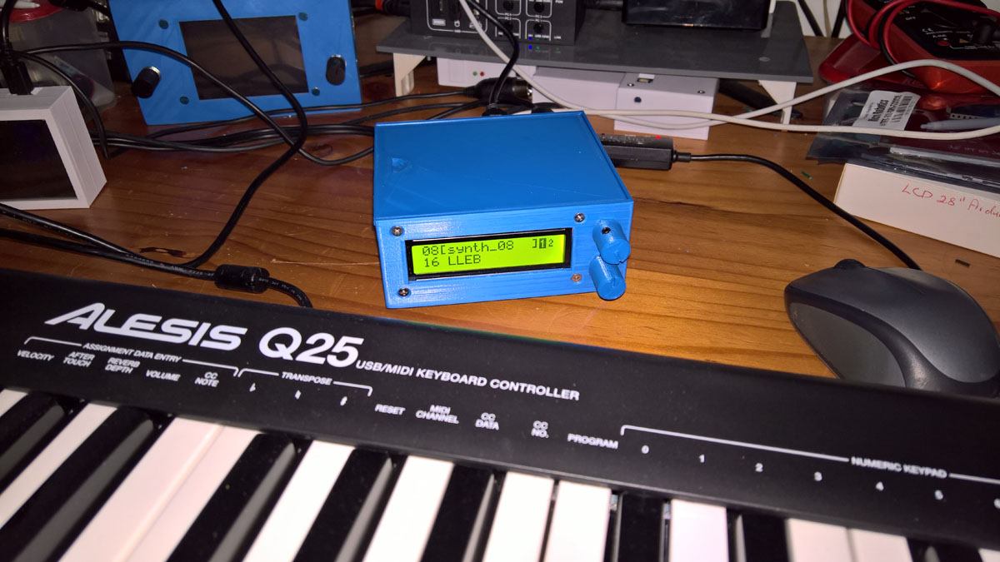
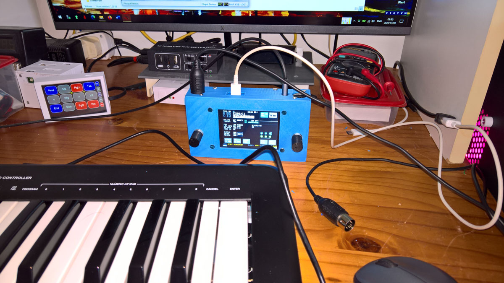
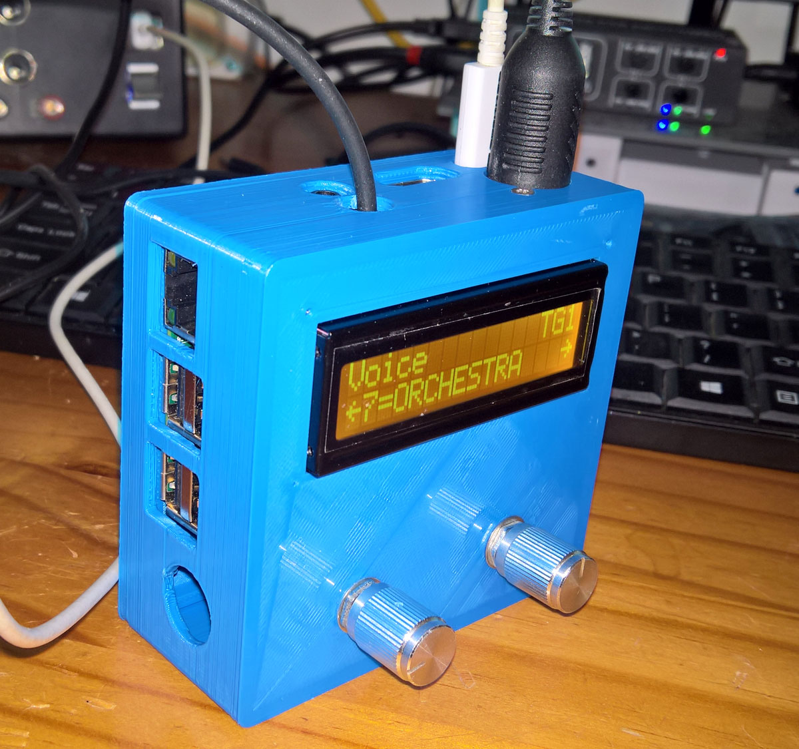
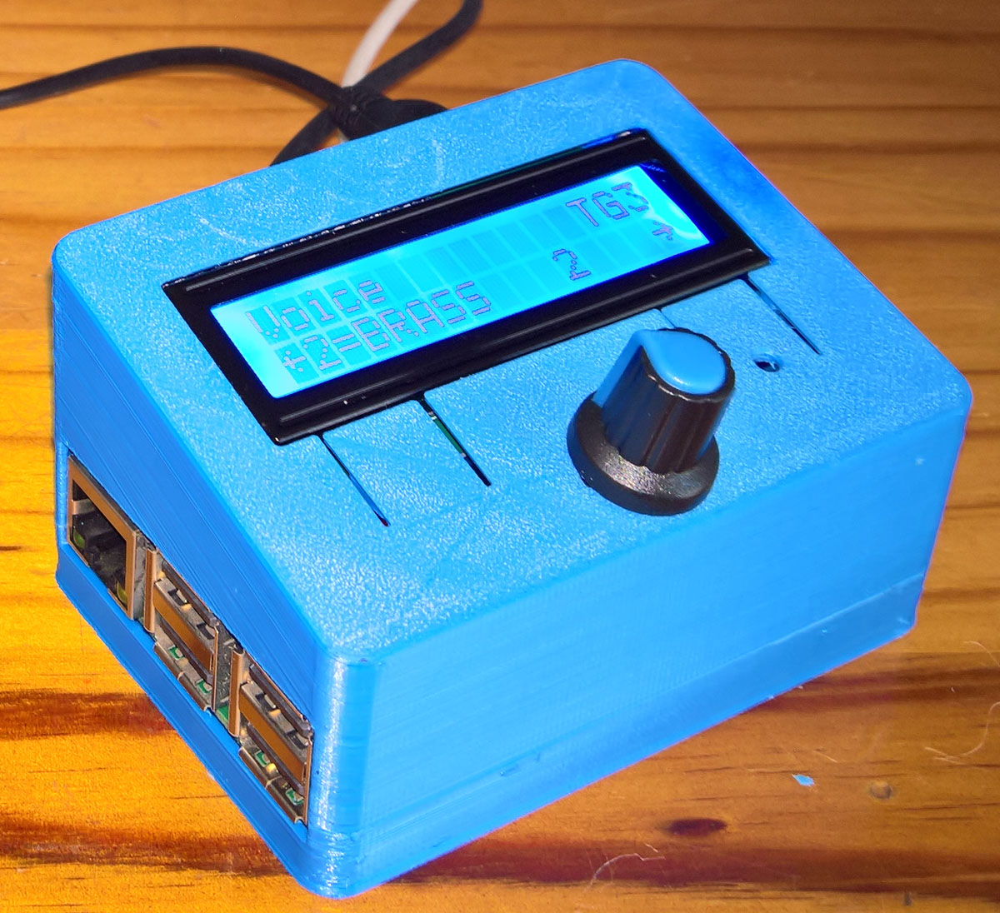

# Microdexed and Minidexed Synth Variations

Variations of the Microdexed FM Synth by [**Codeberg-dcoredump**](https://codeberg.org/dcoredump/MicroDexed) - using a PCM5102A module, and 6N137 for the Midi input, and Microdexed Touch FM Synth by [**Codeberg-positionhigh**](https://codeberg.org/positionhigh/MicroDexed-touch) - it replaced the 2.8 inch LCD with a 3.2 inch sized LCD, used full-sized Midi in and out sockets, and a 6N137 for the Midi input.

Two Circle-based synths namely a variation of the Minidexed Raspberry Pi FM Synth 8xDX7 by [**Probonopd**](https://github.com/probonopd/MiniDexed) using a Waveshare WM8960 DAC Hat and a 6N137 MidiIn, and an MT32-Pi using a Raspberry 3A+ and WM8960 DAC.
 

 
 
  
   

* [**Microdexed FM Synth Teensy 3.6 Variation**](Microdexed1)

* [**MicrodexedTouch FM Synth Teensy 4.1 Variation**](Microdexed2)

* [**Microdexed FM Synth Teensy 4.0 and Teensy 4.1 Dev-branch Variation**](Microdexed3)

* [**Minidexed FM and MT32-Pi Raspberry Pi 3B+ and 3A+ and WM8960 DAC Circle-based Synths**](Minidexed1)
