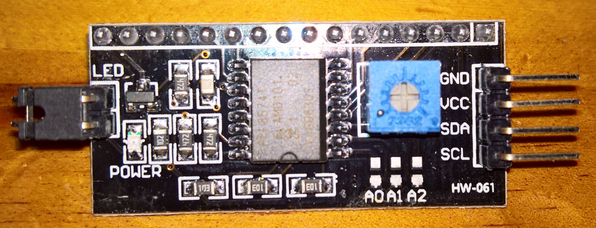
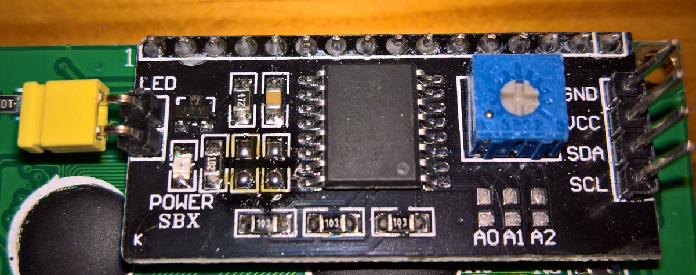

## Using i2c Backpacks with 5v LCD displays and 3v3 MCU's or Raspberry Pi's

When using a 5v LCD 1602 character display remove the two two SMD 4k7 resistors to the lower left of the IC - they are on the I2C Interface that pulls SDA and SCL up to 5v - and then add external resistors that pull them up to 3v3 when using these 5v displays with a Teensy 3.6, 4.0 or 4.1, or with a Raspberry Pi - see the before and after photos below. 

This is also mentioned here: [**16x2 LCD**](https://github.com/probonopd/MiniDexed/wiki/Hardware#usb-midi-device)
*LCD1602 display or similar.  So you can get a display with or without an i2c "backpack" board. An an i2c "backpack" board greatly simplifies the setup because fewer physical connections need to be made.*

***WARNING: Simpler backpacks are designed to be powered by 5V and include pull-up resistors on the I2C bus to 5V too. If you have one of these you will need a 3V3 to 5V level shifter to avoid pulling up the Pi's I2C GPIO pins to 5V! Alternatively it may be possible to remove (desolder) the built-in pull-ups to 5V and add new ones to 3V3. If you're not sure what kind you have, power the LCD from 5V and GND only and measure the voltage on the I2C pins to see if it is 5V or 3V3. Non-backpack LCDs, whilst still powered by 5V, are only connected to Pi GPIO outputs, so driving them at 3V3 from the Pi is fine.***

 
 

